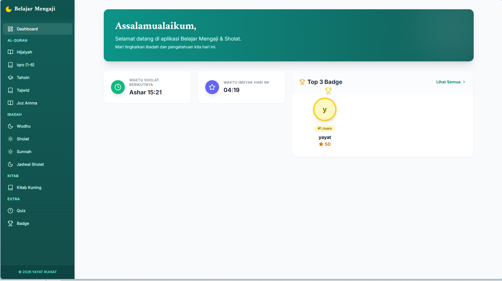

# Belajar Mengaji & Ibadah App (Learn Quran & Worship)

A comprehensive web application for learning to read the Quran, prayer guides, and Islamic knowledge. Built with modern web technologies to provide an interactive and accessible learning experience.



## Key Features

### 📖 Quran & Learning
*   **Hijaiyah**: Introduction to basic Hijaiyah letters with audio pronunciation.
*   **Digital Iqro**: Complete Iqro materials from Volume 1 to Volume 6 with progressive reading exercises.
*   **Tahsin**: Guide to improving Quranic reading, including Makharijul Huruf (places of articulation) and Sifatul Huruf (characteristics of letters).
*   **Tajwid**: Detailed explanations of reading rules (Mad, Dead Nun/Tanwin, Dead Mim, Qalqalah, etc.).
*   **Juz Amma**: Memorization of short Surahs from Juz 30.

### 🕌 Worship Guides
*   **Prayer Times & Imsyak**: Accurate prayer times automatically based on user location (powered by Aladhan API).
*   **Wudhu Guide**: Step-by-step guide to perform ablution (Wudhu) correctly.
*   **Fard Prayer Guide**: Readings, movements, and intentions (Niat) for obligatory prayers.
*   **Sunnah Prayer**: Guides for various Sunnah prayers.

### 📚 Books & Knowledge
*   **Nahwu & Shorof**: Introduction to basic Arabic grammar (Kitab Kuning).

### 🏆 Gamification Features
*   **Islamic Quiz**: Test your knowledge with interactive quizzes.
*   **Leaderboard**: Rankings to motivate learning progress.
*   **Badges**: Awards for learning achievements.

## Technology Stack

This application is built using:
*   **[React](https://reactjs.org/)**: Main UI library.
*   **[Vite](https://vitejs.dev/)**: Super fast build tool.
*   **[Tailwind CSS](https://tailwindcss.com/)**: Utility-first CSS framework for modern and responsive styling.
*   **[Lucide React](https://lucide.dev/)**: Beautiful and lightweight icon set.
*   **[Axios](https://axios-http.com/)**: For API data fetching (Prayer Times).
*   **[Firebase](https://firebase.google.com/)**: Backend service (for Leaderboard/Database features).

## Installation & Running

Follow these steps to run the project on your local machine:

1.  **Clone the repository:**
    ```bash
    git clone https://github.com/yayat/belajar-mengaji.git
    cd belajar-mengaji
    ```

2.  **Install dependencies:**
    Make sure Node.js is installed.
    ```bash
    npm install
    ```

3.  **Run development mode:**
    ```bash
    npm run dev
    ```
    Open `http://localhost:5173` in your browser.

## Project Structure

*   `src/components`: Reusable UI components (Dashboard, Sidebar, etc.).
*   `src/pages`: Main application pages (Quran, Prayer, Quiz).
*   `src/hooks`: Custom hooks (e.g., `usePrayerTimes`).
*   `src/lib`: Third-party library configurations (Firebase).

## License

[MIT](LICENSE)

---
Made with ❤️ for Islamic learning.
